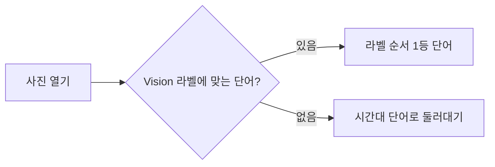
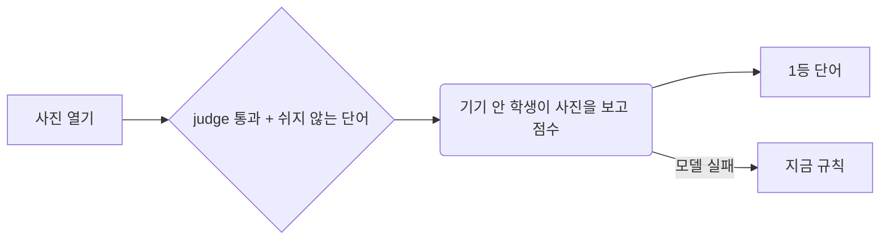

# PRD: 몽돌 단어 — 기기 안 학생 모델과 넓어진 단어 목록

2026-10-04 · Owner Tabber · 근거 [회의 기록](./2026-10-03-mongdol-word-llm-session-log.md) · brief [2026-10-03-mongdol-word-llm-brief.md](./2026-10-03-mongdol-word-llm-brief.md)

이 PRD 는 둘 중 첫 번째다. 「다른 말 고르기 + 기기 안에서 그 사람에게 맞추기」와 「개선에 참여하기」는 두 번째 PRD 로 뗀다(2026-10-04 Tabber).

## Goal

사진에 붙는 단어가 대상을 잘못 보거나, 순간을 못 읽거나, 시간대 말로 둘러대지 않는다. 사진을 기기 밖으로 보내지 않고, 기기 안 학생 모델이 사진을 보고 넓어진 순우리말 목록(약 1,800개)에서 고른다.

실험으로 확인한 출발점(평가 93장, Tabber 블라인드 판정):

| | 맞음 | 틀림 | 결 있고 맞음 |
|---|---|---|---|
| 지금 규칙 (몽돌 사진 47장) | 43% | 15 | 19% |
| 선생 Qwen3.5, 목록 v4 (몽돌 사진 47장) | 83% | 2 | 83% |

## Non-Goals

- 사진·사진 값(임베딩)을 기기 밖으로 보내기 — 이 앱의 첫 약속이다.
- 앱 안에서 모델이 혼자 배우기(기기 안 맞춤), ↻ 옆 「다른 말 고르기」 — 두 번째 PRD.
- 「개선에 참여하기」(켠 사람만 단어 정보 보내기, CloudKit 공용 DB) — 두 번째 PRD.
- 목록 밖 단어 짓기 — 단어는 늘 사람이 고른 목록에서만 나온다.
- 2단계 「AI 한 줄」(`docs/designs/mongdol-photo-word.md` §6) — 따로 둔다.
- Apple Intelligence(iOS 27 Foundation Models) 고르기 — 주력에서 뺐다(2026-10-03).
- 이미 붙은 단어 다시 고르기 — 사실과 어긋나는 단어만 지금처럼 바꾼다.

## Success Criteria

- [ ] 평가 사진 중 몽돌 사진 47장에서 학생의 「맞음」≥ 70%(선생 83% 의 85%), 틀림 ≤ 7(지금 규칙 15의 절반 이하) — Tabber 블라인드 판정.
- [ ] 같은 47장에서 「결 있고 맞음」≥ 40%(지금 규칙 19% 의 두 배 이상).
- [ ] 같은 47장에서 한 단어가 4번 넘게 나오지 않는다.
- [ ] iPhone 13(iOS 18)에서 사진 한 장 단어 고르기 ≤ 0.2초(인코더 + 고르기 층).
- [ ] 앱 크기 ≤ 25MB(TinyCLIP-8M 기준. 39M 으로 올리면 ≤ 55MB 로 다시 잡는다).
- [ ] 단어가 비는 사진 0 — 모델이 없거나 실패하면 지금 규칙으로 고른다.
- [ ] 업데이트 뒤에도 이미 붙은 단어가 하나도 바뀌지 않는다(사실과 어긋난 단어 제외, 지금과 같음).
- [ ] 옛 버전 기기와 iCloud 로 섞여도 새 단어가 지워지지 않는다.

## Target Path

`Color-Moments` (몽돌). 공방 코드는 `Color-Moments/workshop/`.

## Allowed Touch Surface

- `Color-Moments/Shared/Word/**` — `words.json`(v6), `WordList.swift`(새 필드), `WordPicker.swift`(후보·고르기·판정), `PhotoContext.swift`(음력·양력 날짜), 새 `WordModel.swift`(Core ML 학생 불러오기·점수)
- `Color-Moments/Shared/Day/DayPhotoView.swift` — `pickWord` 흐름만
- `Color-Moments/ColorMoments/App/WordAssistant.swift`, `Shared/Word/WordChoice.swift`의 `WordAssist` — 빼기
- `Color-Moments/ColorMoments/App/WordRelabelReport.swift` — 디버그 비교를 학생 기준으로
- 명조 서브셋 글꼴 파일과 `FontSubsetTests` — 새 단어 글자 더하기
- Core ML 모델 파일(앱 번들), `project.yml`
- `Color-Moments/workshop/**` — 실험 코드(`spikes/word-distill`)를 정리해 옮긴 공방
- `Color-Moments/PRIVACY.md`, `SPEC.md`, `DESIGN.md` — 기기 안 모델 한 줄, 단어 흐름
- 관련 테스트

## Disallowed Areas

- 위젯·잠금화면 확장의 단어 표시 코드(위젯 소스에 한글을 넣으면 `FontSubsetTests` 가 깨진다)
- iCloud 동기화·병합(`Sync/**`, `MomentMerge`), `Moment` 저장 형식
- 기존 170개 단어의 id 와 조건 넓히기(좁히기만 된다)
- 사진 담기·캡처(`Capture/**`), 조약돌·도장(`Keepsake/**`)
- 사진 앱 보관함 원본

## Constraints

- **사진은 기기 밖으로 나가지 않는다.** 모델은 기기 안에서만 돈다. 앱스토어 개인정보 표시는 바뀌지 않는다.
- **거짓말 안 하기**: 후보는 `judge` 가 `.yes` 인 단어만. 모르는 날씨·기온이 걸린 단어는 고르지 않는다(지금과 같다).
- **이미 붙은 단어는 건드리지 않는다.** 「쉬게 하기」는 새로 고를 때만 후보에서 빠진다(`retired` 와 다르다).
- **기존 id 조건을 넓히지 않는다** — 옛 버전 기기가 지운다. 넓히려면 새 id.
- iOS 18 최소 버전 유지, 의존성 없음(Core ML·Vision 만).
- 모델 갱신은 앱 업데이트로만. 인코더는 그대로 두고 보통 고르기 층(약 2MB)만 바뀐다.
- 재촉·스트릭·판단 금지(SPEC §2).
- **라이선스**(2026-10-04 확인)
  - 이미지 인코더 **TinyCLIP-ViT-8M/16 (MIT)** 기본, 모자라면 TinyCLIP-ViT-39M/16 (MIT). 앱 정보에 MIT 고지를 넣는다.
  - ❌ MobileCLIP / MobileCLIP2: Apple Machine Learning Research Model License — 비상업 연구 전용, 「상업 제품이나 서비스」에 못 쓴다. 실험에서 가장 좋았지만 넣지 않는다.
  - 선생 Qwen3.5-35B-A3B: Apache 2.0 — 출력으로 학생을 가르쳐도 된다.
  - 단어·뜻풀이: 국립국어원 표준국어대사전 CC BY-SA 2.0 KR — 출처 표시는 설정 화면에 넣었다(브랜치 `fix/mongdol-dictionary-credit`).

## 설계

### 1. 단어가 붙는 흐름

1. **후보**: 라벨과 상관없이 `judge` 를 통과하고 쉬게 하지 않은 단어 전부(사진당 수백 개).
2. **고르기**: 학생 모델 = 이미지 인코더(고정) → 사진 값 512개 → 고르기 층(우리가 가르친 것, 단어마다 점수). 후보 안에서 1등.
3. **대비책**: 모델을 못 불러오거나 실패하면 지금 규칙(Vision 라벨 → 단어, 없으면 때 말).
4. ↻ 는 학생 점수 2등(쉬게 한 말·이미 버린 말 제외).
5. `WordAssist`(Apple Intelligence 고르기)는 뺀다.

### 2. 모델 싣기

- 앱 번들에 넣는다(설치 뒤 내려받기 안 함). TinyCLIP-8M int8 ≈ 8MB + 고르기 층 ≈ 2MB → 앱 ≈ 20MB.
- 전처리(크기·자르기·정규화)를 Core ML 모델 안에 넣어 맥과 iPhone 이 같은 입력을 받게 한다.
- 0.2초를 넘으면 사진을 열 때가 아니라 담을 때 미리 고른다.
- **모델을 「새로 가르친다」는 공방(맥스튜디오)에서 고르기 층을 다시 만들어 새 앱 버전에 넣는다는 뜻이다.** 앱이 혼자 배우지 않는다(그건 두 번째 PRD).

### 3. 단어 목록 데이터 (`words.json` v6)

- 기존 170개: id·조건 그대로. 이름표 64개 + 어둑발 + 약한 8개(짬·보금자리·꼬마·주전부리·새참·적바림·글월·모꼬지)는 `rest: true`.
- 새 단어 약 1,620개: 표준국어대사전 고유어 명사에서 Tabber 가 고르고(일부는 Tabber 기준으로 Claude 판단), 「때」의 지금 기준 말 59개·사진으로 알 수 없는 말 26개를 뺀 것. 새 id 는 로마자(겹치면 숫자). 뜻풀이는 사전 첫 뜻 그대로(국립국어원이 가장 대표적인 뜻으로 첫머리에 둔다 — 2026-10-04 Tabber, 줄여 「…」로 끊지 않는다). 첫 뜻이 50자를 넘는 158개(대부분 식물도감식 설명)는 30자 안쪽 한 줄로 새로 쓴다(예: 민들레 「봄 길가의 노란 꽃, 씨는 솜털로 날아간다」, `~/mongdol-word-lab/meanings-rewritten.json`). 몽돌·새살림은 쉬게 한다.
- 새 필드: `rest`(쉬게 하기), `lunar`(음력 "MM-DD" — 설날·한가위·대보름 등 19개. 섣달그믐·작은설·까치설날은 `12-last` = 다음 날이 음력 1월 1일인 날, 섣달이 29일인 해도 맞다), `solar`(양력 "MM-DD" — 어린이날·장마 등 9개).
- 음력: `Calendar(identifier: .chinese)` + 서울 시간대. 윤달은 맞지 않는 것으로 본다.
- 새 단어의 사실 조건은 공방에서 초안(478개에 조건, 2026-10-04 Tabber 확인 — 봄달에 저녁·밤 더함)을 만들었다 — 앱에 넣기 전에 판정 규칙 테스트로 확인한다.
- 옛 버전 기기는 새 id 를 모르면 지우지 않는다(지금 규칙). 단어·뜻이 기록에 같이 있어 그대로 보인다.
- 선생 전용 정보(장면 갈래, 기존 말 대상 힌트)는 공방에만 둔다.
- 명조 서브셋에 새 단어 글자를 더한다. 뺀 단어 글자도 지우지 않는다.

### 4. 공방 (`Color-Moments/workshop/`)

- 실험 코드(`spikes/word-distill`)를 정리해 옮긴다: 사진·후보·사진 값 뽑기(Swift, 앱 단어 코드를 그대로 컴파일), 사실 조건 판정(`cond.py` → 앱 Swift 판정과 같은 결과인지 테스트), 선생(Qwen 두 번 묻기: 장면 갈래 → 단어), 학생 학습, Core ML 변환, 블라인드 판정 페이지, 사전 후보 고르기 페이지.
- 사진·판정 기록·사전 자료는 저장소 밖(`~/mongdol-word-lab`). 사전 자료는 CC BY-SA 라 저장소에 올리지 않는다.
- 학습용 사진 값은 **앱에 들어갈 그 Core ML int8 모델로** 뽑는다(맥·iPhone Vision 라벨이 79% 만 같았던 교훈). 맥과 iPhone 값이 거의 같은지 사진 몇 장으로 확인한다.
- README: 맥이 바뀌어도 이어 갈 수 있게(환경 `~/.venvs/mongdol-word-lab`, torch 2.7.0 고정).

### 5. 출시

TestFlight 로 Tabber 기기에서 속도·오류만 확인하고 바로 출시한다(2026-10-04 Tabber: 「적어도 지금 버전보다는 훨씬 풍부해져서 좋다」). 길게 써 보는 기간은 두지 않는다.

## Dependencies

- 학습 사진 3,000장 선생 답(목록 v4, Tabber 터미널에서 도는 중) → 쉬게 한 말이 붙은 사진을 빼고 학생 학습.
- 학생 성적 판정(Tabber) → TinyCLIP-8M / 39M 결정.
- 브랜치 `fix/mongdol-dictionary-credit`(사전 출처 표시) 머지.
- iPhone 13 실기기 측정(Tabber).

## Acceptance Evidence

- 평가 94장 블라인드 판정 결과표(`~/mongdol-word-lab/verdicts.json` 집계) — 학생 vs 지금 규칙 vs 선생.
- iPhone 13 에서 사진 20장 단어 고르기 시간(평균·최대) 기록.
- 맥 Core ML 사진 값 vs iPhone 사진 값 코사인 유사도(사진 5장).
- 테스트: 음력·양력 판정, 쉬게 한 단어가 후보에서 빠지되 붙은 단어는 남는지, 기존 170개 조건이 이전 버전보다 넓어지지 않았는지, id 중복 없음, 모르는 id 를 지우지 않는지, 모델 실패 시 규칙으로 넘어가는지, `FontSubsetTests`.
- 앱 크기(App Store Connect 표시값).

## Open Questions

- TinyCLIP-8M 과 39M 중 무엇 — 목록 v4 학생을 Tabber 가 판정해서 정한다(기준: 몽돌 사진 맞음 ≥ 70%).
- 윤달이 섣달에 드는 해의 섣달그믐(드물다) — `12-last` 규칙이 맞는지 테스트로 확인.
- 학생이 후보 밖 단어를 지어낼 수는 없다(분류기라서) — 선생에서 보인 「지어내기 4장」은 앱에선 생기지 않는다. 확인만.

## As-Is → To-Be

차이: 단어 후보가 라벨에 묶이지 않고, 기기 안 학생이 사진을 직접 보고 약 1,800개 목록에서 고른다.

## Owner

Tabber

## Wireframe

UI 변경 없음 — 생략(단어가 붙는 자리·↻ 는 그대로).
