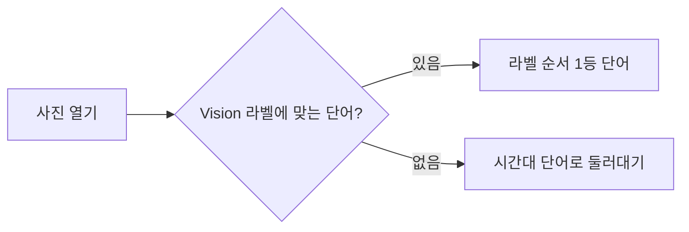
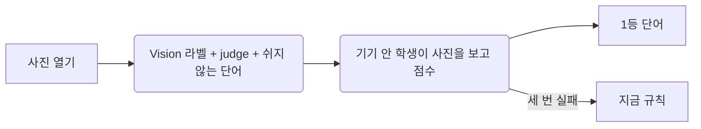

# PRD: 몽돌 단어 — 기기 안 학생 모델과 넓어진 단어 목록

2026-10-04 · Owner Tabber · 근거 [회의 기록](./2026-10-03-mongdol-word-llm-session-log.md) · brief [2026-10-03-mongdol-word-llm-brief.md](./2026-10-03-mongdol-word-llm-brief.md) · 리뷰 [합의](../reviews/2026-10-04-mongdol-word-model/summary.md)

이 PRD 는 둘 중 첫 번째다. 「다른 말 고르기 + 기기 안에서 그 사람에게 맞추기」와 「개선에 참여하기」는 두 번째 PRD 로 뗀다(2026-10-04 Tabber).

## Goal

사진에 붙는 단어가 대상을 잘못 보거나, 순간을 못 읽거나, 시간대 말로 둘러대지 않는다. 사진을 기기 밖으로 보내지 않고, 기기 안 학생 모델이 사진을 보고 넓어진 순우리말 목록(약 1,800개)에서 고른다.

실험으로 확인한 출발점(평가 93장, Tabber 블라인드 판정):

| | 맞음 | 틀림 | 결 있고 맞음 |
|---|---|---|---|
| 지금 규칙 (몽돌 사진 47장) | 43% | 15 | 19% |
| 선생 Qwen3.5, 목록 v4 (몽돌 사진 47장) | 83% | 2 | 83% |

선생 점수는 같은 93장 판정을 보며 목록과 물음을 다듬어 나온 것이라 이 사진에 맞춰진 점수다(리뷰 CEO H1). 그래서 최종 판정에는 처음 보는 사진을 더한다.

## Non-Goals

- 사진·사진 값(임베딩)을 기기 밖으로 보내기 — 이 앱의 첫 약속이다.
- 앱 안에서 모델이 혼자 배우기(기기 안 맞춤), ↻ 옆 「다른 말 고르기」 — 두 번째 PRD.
- 「개선에 참여하기」(켠 사람만 단어 정보 보내기, CloudKit 공용 DB) — 두 번째 PRD.
- 목록 밖 단어 짓기 — 단어는 늘 사람이 고른 목록에서만 나온다. 학생은 분류기라 지어낼 수 없다.
- 「AI가 고른 단어」 표시 — 하지 않는다(brief 안건 6, 2026-10-04 Tabber).
- 2단계 「AI 한 줄」(`docs/designs/mongdol-photo-word.md` §6) — 따로 둔다.
- Apple Intelligence(iOS 27 Foundation Models) 고르기 — 주력에서 뺐다(2026-10-03).
- 이미 붙은 단어 다시 고르기 — 사실과 어긋나는 단어만 지금처럼 바꾼다.
- 잠금화면 캡처·위젯 확장에서 단어 고르기.

## Success Criteria

판정은 Tabber 블라인드. 아래 두 묶음 **모두**에서 넘어야 출시한다.
- 평가 사진 중 몽돌 사진 47장
- 학습·평가 어느 날과도 겹치지 않는 처음 보는 사진 30장

- [ ] 학생의 「맞음」≥ 70%(선생 83% 의 85%), 틀림 ≤ 7/47 · ≤ 5/30.
- [ ] 「결 있고 맞음」≥ 40%(지금 규칙 19% 의 두 배 이상).
- [ ] 47장에서 한 단어가 4번 넘게 나오지 않는다(최근 14장 피하기를 흉내 내어 잰다).
- [ ] 처음 보는 사진 500장에서 학생이 고른 단어 상위 20개가 절반을 넘지 않는다(다양성이 학습 데이터 쏠림으로 빠지지 않는지).
- [ ] iPhone 13(iOS 18)에서 사진 한 장 단어 고르기(Vision 라벨 + 인코더 + 고르기 층) ≤ 0.2초. 넘으면 앱이 사진을 받을 때 미리 고른다.
- [ ] 앱 크기 ≤ 25MB(TinyCLIP-8M 기준. 39M 으로 올리면 ≤ 55MB 로 다시 잡는다).
- [ ] 단어는 세 번 안에 붙는다 — 모델이 2초 넘게 걸리거나 실패하면 그때는 비우고 다음에 열 때 다시, 세 번 실패하면 규칙 단어.
- [ ] 업데이트 뒤에도 이미 붙은 단어가 하나도 바뀌지 않는다(사실과 어긋난 단어 제외, 지금과 같음).
- [ ] 옛 버전 기기와 iCloud 로 섞여도 새 단어가 지워지지 않는다.

## Target Path

`Color-Moments` (몽돌). 공방 코드는 `Color-Moments/workshop/`.

## Allowed Touch Surface

- `Color-Moments/Shared/Word/**` — `words.json`(v6), `WordList.swift`(새 필드), `WordPicker.swift`(후보·쉬게 하기·판정), `PhotoContext.swift`(음력·양력 날짜), 새 `WordScorer` 주입 지점, 한국 음력 표 리소스
- `Color-Moments/ColorMoments/App/` — 새 `WordModel`(인코더 Core ML + 고르기 층 파일, 앱 타깃에만), `WordAssistant.swift` 빼기, `WordRelabelReport.swift` 학생 기준으로, `SettingsSheet.swift` 문구
- `Color-Moments/Shared/Day/DayPhotoView.swift` — `pickWord`·`reject`·`hasAlternative` 흐름
- `Color-Moments/Shared/Day/DayStore.swift` — 최근 단어·같은 날 조약돌 이름 피하기에 필요한 조회만
- `Color-Moments/Shared/Word/WordChoice.swift`의 `WordAssist` — 빼기
- 명조 서브셋 글꼴 파일, `FontSubsetTests`(상한을 근거와 함께), `WordListTests`(조약돌 이름 규칙을 「같은 날만」으로)
- `project.yml` — 모델·`words.json`·명조 글꼴을 확장 타깃에서 빼기
- `Color-Moments/workshop/**` — 실험 코드(`spikes/word-distill`)를 정리해 옮긴 공방
- `Color-Moments/NOTICE`, `PRIVACY.md`, `SPEC.md`, `DESIGN.md`
- 관련 테스트

## Disallowed Areas

- 잠금화면 캡처·위젯 확장의 코드와 단어 표시(위젯 소스에 한글을 넣으면 `FontSubsetTests` 가 깨진다). 확장은 모델을 싣지도 부르지도 않는다.
- iCloud 동기화·병합(`Sync/**`, `MomentMerge`), `Moment` 저장 형식
- 기존 170개 단어의 id 와 조건 넓히기(좁히기만 된다)
- 사진 담기·캡처(`Capture/**`), 조약돌·도장(`Keepsake/**`, 조약돌 이름 목록 `PebbleName.swift` — 읽기만)
- 사진 앱 보관함 원본

## Constraints

- **사진은 기기 밖으로 나가지 않는다.** 모델은 기기 안에서만 돈다. 앱스토어 개인정보 표시는 바뀌지 않는다.
- **거짓말 안 하기**: 후보는 `judge` 가 `.yes` 인 단어만. 날씨·기온·뇌우·폭우가 걸린 단어는 WeatherKit 값이 있을 때만, 없으면 고르지 않는다(지금과 같다).
- **이미 붙은 단어는 건드리지 않는다.** 「쉬게 하기」는 새로 고를 때만 후보에서 빠진다(`retired` 와 다르다). `contradicted` 는 `rest` 를 보지 않는다.
- **기존 id 조건을 넓히지 않는다** — 옛 버전 기기가 지운다. 넓히려면 새 id. 새 id 는 지난 모든 버전의 id·retired 와 겹치지 않는다.
- **같은 판정을 공방과 앱이 한다** — 음력은 같은 한국 음력 표를 읽고, 사진 리사이즈·자르기는 같은 Swift 함수를 쓴다. 갈리면 기기끼리 단어를 지우는 싸움이 된다.
- iOS 18 최소 버전 유지, 의존성 없음(Core ML·Vision 만).
- 모델 갱신은 앱 업데이트로만. 인코더는 그대로 두고 보통 고르기 층(약 2MB)만 바뀐다.
- 재촉·스트릭·판단 금지(SPEC §2).
- **라이선스**(2026-10-04 확인, 저장소는 공개)
  - 이미지 인코더 **TinyCLIP-ViT-8M/16 (MIT)** 기본, 모자라면 TinyCLIP-ViT-39M/16 (MIT).
  - ❌ MobileCLIP / MobileCLIP2: Apple Machine Learning Research Model License — 비상업 연구 전용, 「상업 제품이나 서비스」에 못 쓴다. 실험에서 가장 좋았지만 넣지 않는다.
  - 선생 Qwen3.5-35B-A3B: Apache 2.0 — 출력으로 학생을 가르쳐도 된다.
  - 단어·뜻풀이: 국립국어원 표준국어대사전 CC BY-SA 2.0 KR — 설정 화면 출처 줄(브랜치 `fix/mongdol-dictionary-credit`) + `Color-Moments/NOTICE` 에 고지(공개 저장소의 `words.json` 에 사전 문장이 들어간다). 사전 원자료(XML)는 저장소에 올리지 않는다.

## 설계

### 1. 단어가 붙는 흐름

1. **라벨**: Vision 라벨은 지금처럼 만든다 — 날씨 짐작과 붙은 단어 판정에 쓰인다.
2. **후보**: 라벨과 상관없이 `judge` 를 통과하고 쉬게 하지 않은 단어 전부(사진당 수백 개). 가까운 14장의 단어·두 번 넘게 버린 단어, **그날 조약돌 이름과 같은 단어**를 뺀다.
3. **고르기**: 학생 = 이미지 인코더(고정, Core ML) → 사진 값 512개 → 고르기 층(우리가 가르친 것, Swift 행렬 곱). 후보 안에서 1등. MainActor 밖에서 돌고, 모델은 앱이 시작한 뒤 미리 불러 둔다.
4. **느리거나 실패할 때**: 2초까지 기다린다. 넘거나 실패하면 이번에는 비워 두고 다음에 열 때 다시. 세 번 실패하면 지금 규칙(Vision 라벨 → 단어, 없으면 때 말 — 대비책에서는 쉬는 이름표 말도 쓴다).
5. **↻**: 학생 점수에서 1등과 **같은 갈래(장면 갈래)가 아닌** 첫 말. ↻ 를 보일지(`hasAlternative`)도 같은 기준으로 판단한다.
6. `WordAssist`(Apple Intelligence 고르기)는 뺀다.

### 2. 모델 싣기

- **앱 타깃(`ColorMoments/App/`)에만** 넣는다. `Shared` 는 잠금화면·위젯 확장에도 복사되기 때문이다(`project.yml`). `Shared` 에는 `WordScorer` 주입 지점만 둔다.
- 인코더: TinyCLIP-8M Core ML int8 ≈ 8MB. 고르기 층: 행렬 + 단어 id 목록 + mean/std 파일 ≈ 2MB. 앱 ≈ 20MB.
- 고르기 층 파일의 단어 id 목록이 `words.json` 과 다르면 모델을 쓰지 않고 규칙으로 간다(목록이 바뀌었는데 모델이 그대로면 엉뚱한 단어가 붙는 것을 막는다).
- 사진 리사이즈·자르기는 앱 Swift 함수 하나, 정규화는 Core ML 모델 안. 공방은 같은 Swift 함수를 그대로 컴파일해 쓴다.
- 0.2초를 넘으면 사진을 열 때가 아니라 **앱이 담긴 사진을 받을 때** 미리 고른다(확장은 건드리지 않는다).
- **모델을 「새로 가르친다」는 공방(맥스튜디오)에서 고르기 층을 다시 만들어 새 앱 버전에 넣는다는 뜻이다.** 앱이 혼자 배우지 않는다(그건 두 번째 PRD).

### 3. 단어 목록 데이터 (`words.json` v6)

- 기존 170개: id·조건 그대로. 이름표 64개 + 어둑발 + 약한 8개(짬·보금자리·꼬마·주전부리·새참·적바림·글월·모꼬지)는 `rest: true`.
- 새 단어 약 1,630개: 표준국어대사전 고유어 명사에서 Tabber 가 고르고(일부는 Tabber 기준으로 Claude 판단), 「때」의 지금 기준 말 59개·사진으로 알 수 없는 말 26개를 뺀 것. 몽돌·새살림은 쉬게 한다.
- 예전에 뺀(retired) 8개 — 개밥바라기·샛별·달무리·비설거지·단잠·달맞이·손때·말벗 — 를 **새 id 로** 다시 넣는다(2026-10-04 Tabber). retired 목록은 그대로 둔다.
- 새 id: 로마자 소문자(`^[a-z]+$`), 한 번 만들어 `words.json` 에 고정. 겹치면 숫자 대신 글자로 구분.
- **뜻풀이**: 사전 첫 뜻의 첫 문장. 사전 번호·따옴표(‘금성03’, 「1」)는 지운다. 40자(두 줄)를 넘거나 다른 말을 가리키기만 하는 뜻(「‘가을바람’의 준말」)은 한 줄로 새로 쓴다(지금까지 158개, 예: 민들레 「봄 길가의 노란 꽃, 씨는 솜털로 날아간다」). 끝맺음은 명사형·문장형이 섞여도 된다.
- **장면 갈래**: 단어마다 14개 갈래 중 하나(새 단어는 공방에서 붙은 것, 기존 170개는 새로 붙인다) — ↻ 가 비슷한 말을 건너뛸 때 쓴다.
- 새 필드: `rest`(쉬게 하기), `lunar`(음력 "MM-DD" — 설날·한가위·대보름 등 19개. 섣달그믐·작은설·까치설날은 `12-last` = 다음 날이 음력 1월 1일인 날), `solar`(양력 "MM-DD" — 어린이날·장마 등 9개), `group`(장면 갈래).
- **음력**: 한국 음력 표(2000~2050, korean_lunar_calendar 가 아는 범위)를 번들에 넣고 앱·공방이 같은 표를 읽는다(`Calendar(.chinese)` 는 중국 기준이라 하루 어긋날 수 있다). 윤달은 맞지 않는 것으로 본다.
- 새 단어의 사실 조건: 공방 초안(477개에 조건, 2026-10-04 Tabber 확인 — 봄달에 저녁·밤 더함).
- **조약돌 이름과 겹치는 단어(약 73개, 노을·햇살·안개 등)**: 두 목록에 다 두고, 그날 조약돌 이름과 같은 단어는 그날 사진에 붙이지 않는다(2026-10-04 Tabber). `testNoWordCollidesWithAPebbleName` 을 이 규칙으로 바꾼다.
- 옛 버전 기기는 새 id 를 모르면 지우지 않는다(지금 규칙). 단어·뜻이 기록에 같이 있어 그대로 보인다.
- 선생 전용 정보(기존 말 대상 힌트 등)는 공방에만 둔다.
- 명조 서브셋: 242자 → 약 590자(≈200KB). 뺀 단어 글자도 지우지 않는다. `testSubsetStaysSmall` 상한을 근거와 함께 올린다. 명조 글꼴·`words.json` 도 확장 타깃에서 뺀다.

### 4. 공방 (`Color-Moments/workshop/`)

- 실험 코드(`spikes/word-distill`)를 정리해 옮긴다: 사진·후보·사진 값 뽑기(Swift, 앱 단어 코드와 리사이즈 함수를 그대로 컴파일), 사실 조건 판정(`cond.py` — 앱 Swift 판정과 같은 결과인지 테스트, 같은 음력 표), 선생(Qwen 두 번 묻기: 장면 갈래 → 단어), 학생 학습, Core ML 변환·고르기 층 파일 내보내기, 블라인드 판정 페이지, 사전 후보 고르기 페이지.
- 사진·판정 기록·사전 자료는 저장소 밖(`~/mongdol-word-lab`).
- 학습용 사진 값은 **앱에 들어갈 그 Core ML int8 모델로** 뽑는다. 검증: 평가 94장에서 맥과 iPhone 의 학생 1등 일치율 ≥ 95%(compute units 고정).
- 학생 학습 자료에서 쉬게 한 단어가 정답인 사진은 뺀다.
- README: 맥이 바뀌어도 이어 갈 수 있게(환경 `~/.venvs/mongdol-word-lab`, torch 2.7.0 고정).

### 5. 출시

TestFlight 로 Tabber 기기에서 속도·오류를 보고, **처음 여는 내 사진 20장에 붙는 단어를 눈으로 확인**한 뒤 바로 출시한다(2026-10-04 Tabber: 「적어도 지금 버전보다는 훨씬 풍부해져서 좋다」). 길게 써 보는 기간은 두지 않는다.

PRIVACY.md 에 두 줄: 단어는 이 기기 안에서 사진을 보고 고른다 / 앱의 단어 모델은 개발자 사진으로 학습했고 사용자 사진은 쓰지 않는다.

## Dependencies

- 학습 사진 3,000장 선생 답(목록 v4, Tabber 터미널에서 도는 중).
- 학생 성적 판정(Tabber) → TinyCLIP-8M / 39M 결정. 둘 다 70% 미만이면 학습 사진을 늘린다(후보 약 5,600장) → 그래도 미만이면 Tabber 와 다시.
- 처음 보는 사진 30장(최종 판정용)·500장(다양성 측정용) — 학습·평가 날짜와 겹치지 않게 보관함에서 뽑는다.
- 브랜치 `fix/mongdol-dictionary-credit`(사전 출처 표시) 머지.
- iPhone 13 실기기 측정(Tabber).

## Acceptance Evidence

- 블라인드 판정 결과표 — 몽돌 47장·처음 보는 30장 각각, 학생 vs 지금 규칙 vs 선생.
- 학습 자료에서 정답으로 3번 이상 나온 단어 수, 처음 보는 500장에서 학생이 고른 서로 다른 단어 수와 상위 20개 비중.
- iPhone 13 에서 사진 20장 단어 고르기 시간(평균·최대, 첫 로드 따로).
- 맥 vs iPhone 학생 1등 일치율(94장).
- 테스트: 음력(표·`12-last`·윤달)·양력 판정, 쉬게 한 단어가 후보에서 빠지되 붙은 단어는 남는지(`contradicted` 가 `rest` 를 안 보는지), 기존 170개 조건이 이전 버전보다 넓어지지 않았는지, 새 id 가 지난 id·retired 와 겹치지 않는지, 모르는 id 를 지우지 않는지, 고르기 층 id 목록 불일치 시 규칙으로 가는지, 모델 실패·2초 초과 시 비우고 세 번째에 규칙으로 가는지, ↻ 가 같은 갈래를 건너뛰는지, 그날 조약돌 이름을 피하는지, 뜻풀이에 숫자·‘’·「」가 없고 40자 이하인지, `FontSubsetTests`.
- 앱 크기(App Store Connect 표시값), 확장 번들에 모델·`words.json` 이 없는지.

## Open Questions

- TinyCLIP-8M 과 39M 중 무엇 — 목록 v4 학생을 Tabber 가 판정해서 정한다.
- 기존 170개의 장면 갈래 붙이기 — 공방에서 초안, Tabber 확인.
- 다시 넣은 8개(손때·말벗·단잠·비설거지 등)는 판정에서 틀림이 많으면 다시 쉬게 한다.

## As-Is → To-Be

차이: 단어 후보가 라벨에 묶이지 않고, 기기 안 학생이 사진을 직접 보고 약 1,800개 목록에서 고른다.

## Owner

Tabber

## Wireframe

[사진 보기의 단어 · 설정 문구](./2026-10-04-mongdol-word-model-wireframes/photo-word.html) — 단어 모양·위치는 그대로, 뜻풀이 최대 두 줄, ↻ 조건, 설정 맨 아래 두 줄.
