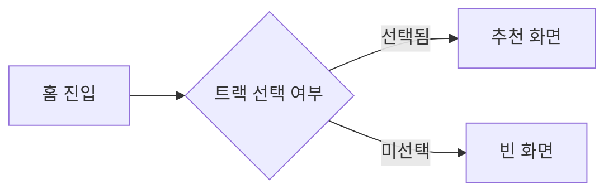
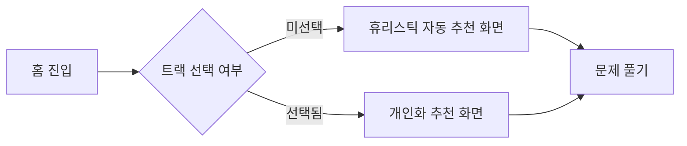

# PRD 예시 — CodeStudy 트랙별 추천 알고리즘 v0.1

> **이 파일은 시드/예시다.** 실제 PRD가 아니라 [PRD_TEMPLATE.md](../process/PRD_TEMPLATE.md) 13필드를 어떻게 채우는지 보여주는 참고용. GitHub에서 보면 Mermaid 흐름도가 그래프로 렌더되어 As-Is / To-Be 비교가 PR 리뷰 안에서 바로 가능하다.

---

## Goal

CodeStudy 사용자가 자기 트랙(Swift/Python/JS)에 맞는 다음 문제를 추천 화면 진입 3초 안에 본다.

## Non-Goals

- 추천 결과 SNS 공유 기능
- 다국어 추천 사유 텍스트 (한국어 우선)
- 학습 진도 시각화 화면 개편

## Success Criteria

- [ ] 추천 화면 진입 P95 응답 ≤ 300ms
- [ ] 추천 결과 1주 클릭률 ≥ 35%
- [ ] 트랙 미선택 사용자에게 빈 화면 노출 0건

## Target Path

CodeStudy/iOS/CodeStudy/Features/Recommend/

## Allowed Touch Surface

- Features/Recommend/**
- Core/Curriculum/RecommendationEngine.swift
- 관련 단위 테스트

## Disallowed Areas

- Features/Onboarding/**
- App Group 스키마
- Claude Haiku 호출 레이어

## Constraints

- zero deps 유지
- MVVM+Observable 패턴 준수
- 추천 1회당 LLM 호출 ≤ 1
- 오프라인 폴백 필수

## Dependencies

- PR #30 트랙 선택 화면 머지
- Curriculum v0.5 데이터셋
- App Group 마이그레이션 v0.4

## Acceptance Evidence

- 추천 화면 시뮬레이터 녹화 30초
- 단위 테스트 커버리지 ≥ 80%
- 클릭률 측정 대시보드 캡처 1주분

## Open Questions

- 신규 사용자 첫 추천은 어떤 휴리스틱으로 시작할지?
- 추천 사유 텍스트는 룰 기반 vs LLM?

## Owner

Tabber

## Wireframe

- [추천 화면 — 트랙 선택 완료](./_template-wireframes/recommend-home.html)
- [추천 화면 — 트랙 미선택 자동 추천](./_template-wireframes/recommend-empty.html)

> 검토 방법: 브랜치 체크아웃 후 `open docs/plans/_template-wireframes/recommend-home.html`로 로컬 브라우저에서 확인. GitHub PR diff에서는 raw HTML로만 보인다.

## As-Is → To-Be

**As-Is** — 트랙 미선택 사용자는 빈 화면을 보게 된다:

**To-Be** — 트랙 미선택 사용자에게도 휴리스틱 기반 자동 추천을 띄운다:

차이: 트랙 미선택 시 빈 화면이 사라지고, 입문자용 휴리스틱 추천 1개 + 트랙 선택 진입점 배너를 띄운다. 두 분기 모두 결국 "문제 풀기" 단일 진입점으로 합류한다.
