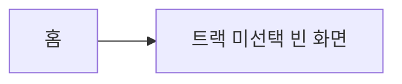
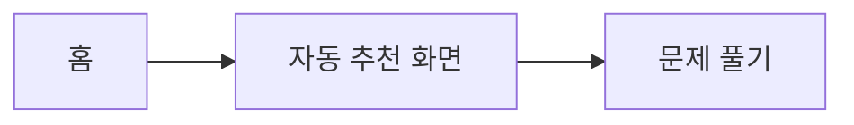

# PRD_TEMPLATE

PRD를 잘 쓰기 위한 양식. 13개 필드 (핵심 11 + 시각화 2).

---

## Purpose

PRD를 작성할 때 비워두면 안 되는 양식이다. Tabber(인간)가 직접 채우고, [4] PARALLEL REVIEW 단계로 넘긴다.

이 양식은 **PRD를 잘 쓰기 위한 가이드**일 뿐, PRD가 통과해야 하는 검문소가 아니다. [3] PRD DRAFT 단계 안에서 빈 채로 시작해 brainstorming으로 채워나가도 된다. 채워진 PRD는 `docs/plans/<date>-<topic>-prd.md`로 저장한다.

작성 흐름:

1. 빈 양식을 복사해 새 파일로 저장한다.
2. 알고 있는 것부터 채운다. 모르는 칸은 비워두거나 `Open Questions`로 옮긴다.
3. [4] PARALLEL REVIEW에서 인간/에이전트가 같이 점검하고 보강한다.

---

## 양식 구조

### Goal

- **정의**: 이 프로젝트가 달성하려는 한 가지 결과. 추상적인 가치 진술 대신 측정 가능한 변화로 쓴다.
- **예시**: CodeStudy 사용자가 자기 트랙(Swift/Python/JS)에 맞는 다음 문제를 추천 화면 진입 3초 안에 본다.

### Non-Goals

- **정의**: 이 PRD가 **하지 않는 일**. 범위 밖에 둘 항목을 명시해서 scope creep을 차단한다.
- **예시**: 추천 결과 SNS 공유, 다국어 추천 사유 텍스트, 학습 진도 시각화 개편.

### Success Criteria

- **정의**: 완료를 판정할 측정 가능한 기준. 숫자/비율/존재 여부 중 하나로 표현한다.
- **예시**: 추천 화면 진입 P95 응답 ≤ 300ms, 추천 결과 1주 클릭률 ≥ 35%, 트랙 미선택 사용자에게 빈 화면 노출 0건.

### Target Path

- **정의**: 변경이 일어날 서비스/모듈 경로. AGENTS.md Repo Map 기준으로 적는다.
- **예시**: `CodeStudy/iOS/CodeStudy/Features/Recommend/`

### Allowed Touch Surface

- **정의**: 이 PRD에서 **수정해도 되는** 파일/디렉터리 범위. ralph loop이 자유롭게 건드릴 수 있는 영역을 미리 합의한다.
- **예시**: `Features/Recommend/**`, `Core/Curriculum/RecommendationEngine.swift`, 관련 단위 테스트.

### Disallowed Areas

- **정의**: 이 PRD에서 **건드리면 안 되는** 영역. 다른 PR과 충돌하거나, 이 PRD 범위를 넘어가는 곳을 명시한다.
- **예시**: `Features/Onboarding/**`, App Group 스키마, Claude Haiku 호출 레이어.

### Constraints

- **정의**: 기술/비기능 제약. 라이브러리, 아키텍처, 성능, 프라이버시, 비용 한계 등.
- **예시**: zero deps 유지, 기존 MVVM+Observable 패턴 준수, 추천 1회당 LLM 호출 ≤ 1, 오프라인 폴백 필수.

### Dependencies

- **정의**: 이 PRD 실행에 **선행되어야 하는** 다른 작업/PRD/외부 자원.
- **예시**: PR #30 트랙 선택 화면 머지, Curriculum v0.5 데이터셋, App Group 마이그레이션 v0.4.

### Acceptance Evidence

- **정의**: 완료를 증명할 증거 형태. 스크린샷/지표/테스트/사용자 검증 중 어떤 것을 남길지 정한다.
- **예시**: 추천 화면 시뮬레이터 녹화 30초, 단위 테스트 커버리지 ≥ 80%, 클릭률 측정 대시보드 캡처 1주분.

### Open Questions

- **정의**: 아직 결정되지 않은 항목. PRD 작성 중에 떠오른 질문을 모아둔다. [4] PARALLEL REVIEW에서 해소한다.
- **예시**: 신규 사용자 첫 추천은 어떤 휴리스틱으로 시작할지? 추천 사유 텍스트는 룰 기반 vs LLM?

### Owner

- **정의**: PRD를 책임질 주인. 단일 인간 1명. 의사결정 충돌 시 이 사람이 자른다.
- **예시**: Tabber

### Wireframe

- **조건**: UI 변경이 있는 PRD에서 필수. 백엔드/데이터 전용 PRD는 생략 가능.
- **형식**: HTML 파일로 작성. `docs/plans/<date>-<topic>-wireframes/<screen>.html`에 저장하고 PRD 본문에서 상대 링크로 참조한다. 핵심 화면 1~3개.
- **작성 가이드**:
  - `div` + inline CSS로 박스/타이포 레이아웃 정도만 표현. 외부 의존성 없이 브라우저에서 단독으로 열람 가능해야 한다.
  - 실제 픽셀 충실도가 아니라 **정보 구조와 사용자 동선**을 보여주는 것이 목적.
  - 화면 상단에 화면 이름·진입 경로·핵심 액션을 주석 또는 헤더로 명시한다.
- **예시**: `[추천 화면](./2026-05-05-recommend-wireframes/recommend-home.html)`, `[빈 상태](./2026-05-05-recommend-wireframes/recommend-empty.html)`
- **검토 방법**: 로컬에서 `open docs/plans/<date>-<topic>-wireframes/<screen>.html`로 연다. GitHub PR diff에선 raw HTML 코드로만 보이므로 [4] PARALLEL REVIEW의 design 리뷰어는 브랜치를 체크아웃해 직접 열어보거나 PR 본문에 캡처를 첨부해 공유한다.
- **시드**: `docs/plans/_template-wireframes/`의 HTML을 복사해 시작한다 (인라인 CSS · 외부 의존성 없음 · iOS 스타일 박스 레이아웃).

### As-Is → To-Be

- **조건**: 사용자 흐름 자체가 바뀌는 PRD에서 필수. 신규 단독 기능이라 비교 대상이 없으면 생략 가능.
- **형식**: PRD 본문에 Mermaid `flowchart LR` 블록 두 개와 한 줄 차이 요약을 직접 박는다.
  - 첫 블록 = As-Is (기존 흐름)
  - 둘째 블록 = To-Be (변경 후 흐름)
  - 마지막 줄 = "차이: ..." 한 줄 요약
- **예시**:
  ```mermaid
  flowchart LR
      A[홈] --> B[트랙 미선택 빈 화면]
  ```
  ```mermaid
  flowchart LR
      A[홈] --> B[자동 추천 화면] --> C[문제 풀기]
  ```
  차이: 트랙 미선택 시 빈 화면 대신 자동 추천 화면을 띄운다.
- **검토 방법**: GitHub PR diff에서 Mermaid 코드 블록은 그래프로 자동 렌더된다. 별도 도구 없이 As-Is와 To-Be 흐름을 PR 리뷰 안에서 바로 비교 가능 — 이게 와이어프레임 HTML과 다른 점이다 (HTML은 raw 코드만 보임).
- **노드 표기 룰**: 화면 이름은 `[]`, 사용자 액션은 `()`, 시스템 분기는 `{}`로 통일한다 (`flowchart LR` 표준). 노드 5개를 넘기면 흐름이 너무 복잡하니 PRD를 쪼갠다.

복사해서 `docs/plans/<date>-<topic>-prd.md`로 저장하고 채운다.

```markdown
# PRD: <한 줄 제목>

## Goal

(이 프로젝트가 달성하려는 측정 가능한 결과 1개)

## Non-Goals

- (범위 밖에 두는 항목)
- (범위 밖에 두는 항목)

## Success Criteria

- [ ] (측정 가능한 기준 1)
- [ ] (측정 가능한 기준 2)

## Target Path

(변경이 일어날 서비스 경로 — AGENTS.md Repo Map 기준)

## Allowed Touch Surface

- (수정 허용 범위)

## Disallowed Areas

- (수정 금지 범위)

## Constraints

- (기술/비기능 제약)

## Dependencies

- (선행 PR/PRD/외부 자원)

## Acceptance Evidence

- (완료 증거 형태)

## Open Questions

- (미결정 질문)

## Owner

(인간 1명)

## Wireframe

(UI 변경이 있을 때만 필수. `docs/plans/<date>-<topic>-wireframes/<screen>.html` 파일들에 대한 상대 링크 1~3개)

## As-Is → To-Be

(사용자 흐름이 바뀔 때만 필수. Mermaid `flowchart LR` 두 블록 + 한 줄 차이 요약)
```

---

## 채워진 예시 — CodeStudy 트랙별 추천 알고리즘 v0.1

> 아래 예시는 4-tick fence 안에 있어서 Mermaid가 그래프로 렌더되지 않는다 (raw 코드만 보인다). **GitHub에서 그래프로 렌더된 모습**은 별도 시드 파일 [`docs/plans/_template-prd-example.md`](../plans/_template-prd-example.md) 참고.

````markdown
# PRD: CodeStudy 트랙별 추천 알고리즘 v0.1

## Goal

CodeStudy 사용자가 자기 트랙(Swift/Python/JS)에 맞는 다음 문제를
추천 화면 진입 3초 안에 본다.

## Non-Goals

- 추천 결과 SNS 공유 기능
- 다국어 추천 사유 텍스트 (한국어 우선)
- 학습 진도 시각화 화면 개편

## Success Criteria

- [ ] 추천 화면 진입 P95 응답 ≤ 300ms
- [ ] 추천 결과 1주 클릭률 ≥ 35%
- [ ] 트랙 미선택 사용자에게 빈 화면 노출 0건

## Target Path

CodeStudy/iOS/CodeStudy/Features/Recommend/

## Allowed Touch Surface

- Features/Recommend/**
- Core/Curriculum/RecommendationEngine.swift
- 관련 단위 테스트

## Disallowed Areas

- Features/Onboarding/**
- App Group 스키마
- Claude Haiku 호출 레이어

## Constraints

- zero deps 유지
- MVVM+Observable 패턴 준수
- 추천 1회당 LLM 호출 ≤ 1
- 오프라인 폴백 필수

## Dependencies

- PR #30 트랙 선택 화면 머지
- Curriculum v0.5 데이터셋
- App Group 마이그레이션 v0.4

## Acceptance Evidence

- 추천 화면 시뮬레이터 녹화 30초
- 단위 테스트 커버리지 ≥ 80%
- 클릭률 측정 대시보드 캡처 1주분

## Open Questions

- 신규 사용자 첫 추천은 어떤 휴리스틱으로 시작할지?
- 추천 사유 텍스트는 룰 기반 vs LLM?

## Owner

Tabber

## Wireframe

- [추천 화면 — 트랙 선택 완료](../plans/_template-wireframes/recommend-home.html)
- [추천 화면 — 트랙 미선택 자동 추천](../plans/_template-wireframes/recommend-empty.html)
  (실제 PRD에서는 자기 PRD 폴더 안 `<date>-<topic>-wireframes/`로 복사해 쓴다)

## As-Is → To-Be



차이: 트랙 미선택 시 빈 화면 대신 휴리스틱 기반 자동 추천 화면을 띄운다.
````

---

## Brainstorming 질문 시퀀스 (시각화 2필드용)

`/brainstorming` 스킬은 "한 번에 한 질문" 룰을 따른다. 시각화 2필드를 채울 때는 이 시퀀스대로 Tabber에게 한 질문씩 던진다. 답을 받기 전에는 다음 질문으로 넘어가지 않는다.

### Wireframe 질문 시퀀스

UI 변경이 있는 PRD에서만 진행한다. 백엔드/데이터 전용 PRD는 통째로 건너뛴다.

1. **이 PRD에서 그릴 핵심 화면은 몇 개인가?** (1~3개로 제한. 그 이상이면 PRD를 쪼갠다)
2. **각 화면의 이름·진입 경로·핵심 액션 한 줄로 적어줄 수 있나?** (와이어프레임 헤더 메타 정보)
3. **기존 화면을 변형하는가, 신규 화면인가?** (변형이면 As-Is → To-Be 시퀀스가 같이 필요할 가능성 높음)
4. **각 화면의 빈 상태/에러 상태도 와이어프레임이 필요한가?** (필요하면 별도 HTML 파일로 분리)
5. **참고할 기존 화면이 있나?** (기존 앱 스크린샷·다른 서비스 캡처 등 — 시드를 어디서 가져올지 정함)

답이 모이면 `docs/plans/<date>-<topic>-wireframes/`에 `_template-wireframes/`의 시드 HTML을 복사해 시작한다.

### As-Is → To-Be 질문 시퀀스

사용자 흐름이 바뀌는 PRD에서만 진행한다. 신규 단독 기능이라 비교 대상이 없으면 통째로 건너뛴다.

1. **현재 사용자는 어떤 단계로 이 목적을 달성하고 있나?** (As-Is 흐름의 노드 나열)
2. **변경 후에는 어떤 단계로 바뀌나?** (To-Be 흐름의 노드 나열)
3. **두 흐름의 가장 큰 차이를 한 줄로 요약하면?** (Mermaid 두 블록 아래 박을 "차이: ..." 한 줄)
4. **삭제되는 단계가 있나?** (To-Be에서 사라지는 노드 — 이게 사용자 영향이 큼)
5. **흐름이 두 갈래로 갈리는 분기점이 있나?** (Mermaid에서 분기 표현 필요)

답이 모이면 PRD 본문의 `## As-Is → To-Be` 섹션에 Mermaid 두 블록 + 한 줄 요약을 직접 박는다.

---

## 비목표 (Non-Goals)

- **PRD_TEMPLATE은 입장 게이트가 아니다.** 양식이 빈 채로 [3] PRD DRAFT 단계가 시작될 수 있다. 단계 [3] 안에서 brainstorming으로 채워나가는 것이 정상 흐름이다.
- **자동 반려 룰 없음.** 누락된 필드를 자동으로 검출해 막는 메커니즘은 두지 않는다. 점검은 [4] PARALLEL REVIEW에서 인간과 에이전트가 같이 한다.
- **시각화 필드 강제 없음.** Wireframe / As-Is → To-Be 두 필드는 조건부 필수다. UI 변경 없는 PRD는 Wireframe 생략, 신규 단독 기능이라 비교 대상이 없으면 As-Is → To-Be 생략.

---

## 관련 문서

- [SEQUENCE.md](SEQUENCE.md) — 6단계 흐름 본문 (PRD_TEMPLATE은 [3] PRD DRAFT의 양식)
- [EXECUTION.md](EXECUTION.md) — PRD 이후 병렬 리뷰 + ralph loop 패턴
- [`docs/plans/_template-prd-example.md`](../plans/_template-prd-example.md) — 13필드 채워진 PRD 시드 (GitHub에서 Mermaid 그래프 렌더 확인 가능)
- [`docs/plans/_template-wireframes/`](../plans/_template-wireframes/) — HTML 와이어프레임 시드 (recommend-home, recommend-empty + README)
